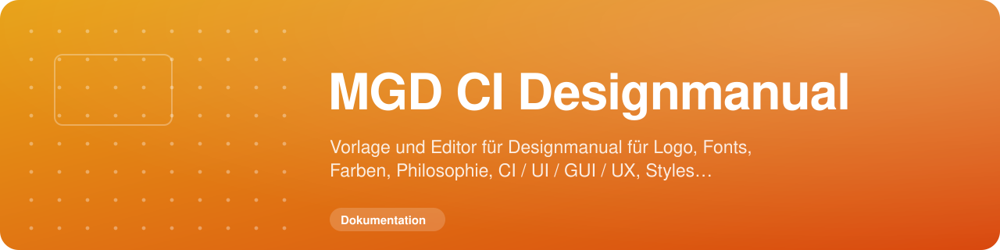

<!-- MGD-HEADER -->

  
  
  

<!-- /MGD-HEADER -->

# Michael Gahn DESIGN – CI BUILDER

[Live-App öffnen](https://ci.michael-gahn.de/)

Der CI BUILDER ist eine Flutter-Webanwendung für Agenturen, Teams und Marken. Er führt durch die Erstellung eines klaren, erweiterbaren Designmanuals und eines Social-Media-Codex. Die Anwendung wird auf deutschem Hosting betrieben und ist von Beginn an auf Datenschutz, lokale Assets und sichere Zugriffssteuerung ausgelegt.

## Aktueller Produktstand

- Deutsch und Englisch als Plattformsprachen, Deutsch als Standard
- Landingpage mit Dark- und Light-Mode; die Wahl wird lokal im Browser gespeichert
- Registrierung, Login, Passwort-Änderung sowie rollenbasierte Administration
- Ein kostenloser Projektplatz und ein geführter Einrichtungsassistent
- Projektgrunddaten sowie optionale private Uploads oder externe HTTPS-Bildreferenzen
- Benutzergetrennte Projekt-Mediathek mit geschütztem API-Zugriff
- Kontoansicht mit serverseitig berechneten Slots und Medienspeicher
- Tarifübersicht für Free, Creator, Studio und Ultimate mit transparentem
  Jahresvorteil; alle Grundfunktionen bleiben im Free-Tarif enthalten
- capability-geschütztes Backoffice: Admins erhalten Tarif-, Zahlungs- und
  Kontostatus-Schnittstellen, Moderation ausschließlich dokumentierte Fälle
- Lokal ausgelieferte Open-Sans-Schrift und lokale Flutter-/CanvasKit-Ressourcen
- Öffentliche Rechtstexte, Cookie-Einstellungen und kein externes Tracking

Die Backoffice-Migration 007 wurde am 24. September 2026 nach verschlüsselter
Sicherung, lesendem Vorabcheck und Funktionsprüfung produktiv angewendet.
Als Nächstes folgen der vollständige Manual-Editor, HTML-/PDF-Export und ein
Stripe-Testkatalog mit signierten Webhooks. Es gibt derzeit keinen Checkout und
keine aktive Belastung.

## Datenschutz und Sicherheit

Passwörter werden ausschließlich serverseitig gehasht verarbeitet. Berechtigungen und Medienzugriffe werden serverseitig geprüft; Konfiguration und Zugangsdaten gehören in eine nicht versionierte `.env`-Datei. Personenbezogene Daten werden auf das notwendige Maß beschränkt.

## Dokumentation

Die versionierte technische Projektdokumentation befindet sich in [`WIKI/`](WIKI/Home.md). Die veröffentlichte Kurzfassung ist im [GitHub-Wiki](https://github.com/MichaelGahnDESIGN/MGD_CI-Designmanual/wiki) verfügbar.
